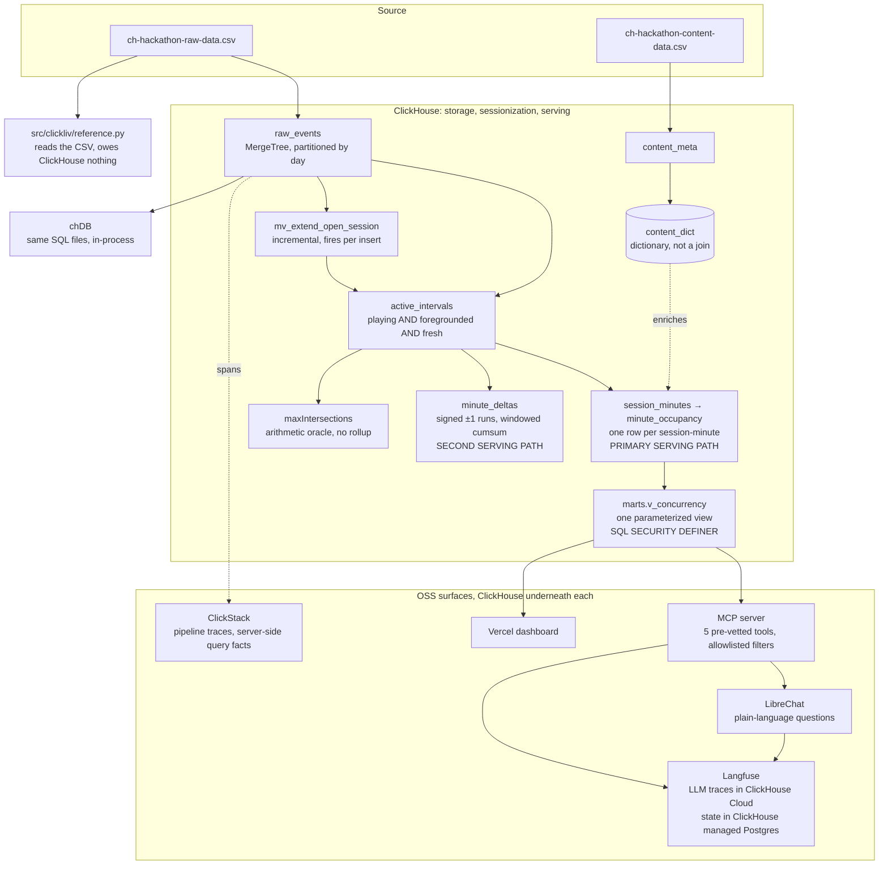

# ClickLiv

**Foreground-only concurrent viewers for SonyLIV streaming telemetry, on ClickHouse.**

An open app is not a viewer. A session counts as concurrent only while it is **playing**,
**foregrounded** and **heartbeat-fresh**. Counting every open session instead overstates
**peak** concurrency by **39.0%** and **average** concurrency by **49.0%**, and it puts the
peak in the wrong minute entirely.

| | Foreground-only | Naive, every open session |
|---|---|---|
| Peak concurrent viewers | **2,692** | 3,743 |
| Minute the peak lands in, UTC | **2026-07-26 10:56** | 2026-07-26 10:59 |
| Average concurrent viewers | **24.2** | 49.0% higher |

Reproduce all three rows from a clean clone in three commands:

```sh
cp .env.example .env
make data
make up && make all
```

`make data` fetches the two source CSVs. They are not in the repository, because `data/`
is gitignored, so a clone without this step fails at load.

`make up` starts ClickHouse in Docker, or point `.env` at ClickHouse Cloud instead. Note
that the Cloud service this project runs against is 26.4, so `EXPLAIN ANALYZE`, which
needs 26.7, is unavailable there and the code records that rather than failing.
`make all` runs CSV to Gate A in about eight seconds and prints twelve cross-path checks.
`make chdb` reproduces the same numbers in-process with chDB, no server and no Docker at
all.

---

## Results

Both datasets are published here, same metric names, same order, same units. The tuning
dataset is the one shipped with the problem statement. The final column is filled from a
single `make replay` against the sealed dataset.

<!-- FINAL DATA PASTES HERE. Replace every "pending" in the two tables below and nowhere
     else. Source: make replay, then answers/benchmark_answers.csv, submission/manifest.json
     and marts.v_overcount. Every other number in this README is prose about the method,
     not about a particular dataset. -->

### Concurrency

| Measure | Tuning dataset | Final dataset |
|---|---|---|
| Peak concurrency, foreground-only, unfiltered | **2,692** | pending |
| Minute of peak, UTC | 2026-07-26 10:56:00 | pending |
| Peak concurrency, naive, any open session | 3,743 | pending |
| Minute of naive peak, UTC | 2026-07-26 10:59:00 | pending |
| Peak overcount from counting open sessions | **39.0%** | pending |
| Average overcount from counting open sessions | **49.0%** | pending |
| Average concurrency, over minutes any session was open | 24.2 | pending |
| Average concurrency, over minutes carrying active playback | 34.8 | pending |
| Instantaneous peak, point-in-time overlap rather than occupancy | 2,282 | pending |
| Peak, platform ANDROID_PHONE | 1,704 | pending |
| Peak, platform SONY_ANDROID_TV | 279 | pending |
| Peak, video_type live | 425 | pending |
| Peak, video_type vod | 2,222 | pending |
| Peak, audio_language hin | 1,614 | pending |
| Peak, IPHONE in india | 329 | pending |
| Peak, vod on Mweb | 62 | pending |
| Distinct users at the peak minute | 2,626 | pending |

Average concurrency is reported against **two denominators on purpose**, because there is
no single defensible one and the choice moves the answer by 44%. 24.2 divides by the
minutes in which any session was open, which is the denominator the overcount comparison
needs. 34.8 divides by the minutes carrying active playback, which is the denominator
`answers/benchmark_answers.csv` states in its own `average_denominator` column. Both are
labelled everywhere they appear rather than silently picked.

### Dataset shape and pipeline output

| Measure | Tuning dataset | Final dataset |
|---|---|---|
| Raw events loaded | 905,558 | pending |
| Content rows loaded | 33,463 | pending |
| Distinct sessions | 10,866 | pending |
| Active intervals after sessionization | 32,164 | pending |
| Occupancy rows, one per session-minute | 96,818 | pending |
| Minutes carrying at least one session | 3,649 | pending |
| Data window, UTC | 2026-07-14 15:43 to 2026-07-26 11:30 | pending |
| Window span, days | 11.82 | pending |
| Distinct country / platform / video_type | 1 / 10 / 3 | pending |
| Distinct category / audio_language / subtitle_language | 84 / 39 / 10 | pending |
| Serving latency, server-side p50 / p95 / p99, 40 samples | 41 / 49 / 58 ms | pending |
| Gates A, B, C, D | 12/12, byte-identical, PASS, hashes match | pending |

Latency is `query_duration_ms` read from `system.query_log` by `query_id`, never client
wall clock. The target is ours and self-imposed at p99 under 100 ms, because no SLA was
ever published upstream. It moves several milliseconds run to run, so the percentiles live
in `evidence/serving_slo.txt` and the per-sample rows in `evidence/serving_slo.csv`,
recomputable rather than believed.

Every number above is produced by a query this repository ran, tagged with a `query_id`
and traceable to `system.query_log`. See [docs/evidence.md](docs/evidence.md).

---

## Architecture



### Why each piece is here

**ClickHouse** does the work the problem is actually made of. Sessionization is a window
function over 905,558 ordered events, concurrency is a merge of intervals into a minute
grain, and serving is a filtered aggregate over a rollup. Those are columnar operations,
and the whole pipeline from CSV to answers finishes in about eight seconds on the tuning
data. Nothing runs outside the database except the independent Python reference, which
exists precisely so that it can disagree.

**MCP** is the boundary that makes an LLM safe to point at a warehouse. Five pre-vetted
parameterized tools, filter values checked against an allowlist read from the data itself,
and whatever survives arrives as a bound parameter. On the default path the model never
emits SQL. The server connects as a restricted role, so the query budget is enforced by
ClickHouse rather than by prompt instructions.

**LibreChat** is where the question gets asked in plain language. It is the difference
between a dashboard that answers the questions we anticipated and a surface that answers
the ones a judge invents on the spot.

**Langfuse** is the observability pillar for the LLM half, and its own storage is entirely
ClickHouse products: traces in this project's ClickHouse Cloud service, transactional state
in ClickHouse managed Postgres. The pillar is not a name-drop; it is a second ClickHouse
workload.

**ClickStack** traces the pipeline itself, one root span per command, a span per stage, a
span per ingest and a span per query. The query spans deliberately do not report client
wall clock. Before export the tracer flushes logs, reads `system.query_log` for the query
ids it collected, and attaches what the server itself recorded.

---

## The model, and the measurement that forced each decision

### Active is three signals, because no single one is sufficient

| Signal | Why it alone is not enough |
|---|---|
| Background and foreground markers | They do not balance. 14,700 `AppBackgrounded` against 14,321 `AppForegrounded`, and 344 sessions end backgrounded. A state machine that waits for a matching foreground never closes those. |
| Heartbeat gaps | Telemetry keeps flowing during pause. Of the pause windows over 60s, 79.4% contain other telemetry, 314,277 events. A gap rule sees a paused session as alive. |
| Pause and resume markers | Also not guaranteed, and a session can die silently without ever pausing. |

Segments close on pause, background, error, session end, session restart, and on any gap
over the threshold. They reopen on play, resume, and foreground while playing. Because
markers do not balance, closing a background period never depends on a matching
foreground event arriving.

**Pause is excluded from active time.** The question is who is watching, not who has the
app open. That choice is worth 27,340 pause events, so it is stated here rather than
buried, and it is one predicate to flip if SonyLIV defines it the other way.

### Trust the data, not the data dictionary

**The heartbeat is 40s, not the documented 60s.** Four independent telemetry streams sit at
an inter-heartbeat p90 of 40.001s. Every liveness threshold derives from that measured
number: the tail grace is exactly one cadence, the gap threshold is 2.25 cadences. A team
that trusted the document has its thresholds wrong by a full cadence and over-credits every
session tail by 50%.

**There is no pause event type.** `event_type='VideoHeartbeat'` is a bucket of 41 distinct
`event` values, and the playback-state markers live inside it: `pause`, `resume`,
`speed-pause`, `AdPause`. Anything keyed only on `event_type` cannot exclude paused time,
which is one of the three exclusions this track exists to test.

**Dimensions are unstable inside sessions.** `subtitle_language` changes within 99.97% of
sessions and `audio_language` within 81%, so `any(dim) GROUP BY session` fabricates a label
for most sessions. The tuple is resolved per `(session, minute)` with `argMax` on event
order, which also guarantees exactly one tuple per session per minute.

### One row per session-minute, not one per interval

8,184 session-minutes contain more than one active segment. Signed per-interval deltas
bucketed to minutes therefore either double count those or lose them. Deduping to one
active flag per `(session, minute)` fixes it, and it buys the property the whole serving
layer rests on.

**Per-minute concurrency is additive across dimensions.** Each session sits in exactly one
dimension tuple per minute, so summing slice counts gives the total. At the peak minute,
vod 2,214 plus live 400 plus blank 78 is exactly 2,692. That is what lets a single rollup
answer any filter combination.

**Peak is not composable across time,** because `max` does not distribute over sums. The
order of operations is therefore fixed: **filter, sum across the excluded dimensions, then
take the max over minutes.** Never max first. `make crossover` reproduces the problem
statement's own worked example through the served view, finding 4 distinct peak minutes
across 5 real slices.

### Robust to duplicate and co-timestamped events by representation

161,660 groups of events share a timestamp inside a session, and 6,058 of those carry
conflicting state effects, so order within a millisecond changes the answer. Two properties
make that a non-problem rather than a caveat.

The interval model **never counts rows**. It takes the min and max timestamp per segment,
so a repeated or co-timestamped event cannot inflate anything. And only **8** of the
161,660 groups carry a disagreeing dimension tuple, so the `argMax` resolution is
effectively deterministic on this data.

Ordering is still settled by rule rather than left to insertion order: deactivating events
apply last, and both implementations sort by `(timestamp, kind, dimension tuple)`, a total
order. That is why they agree exactly rather than approximately. Stating the rule moved the
headline peak by 0.37%, which is the honest cost of pinning it down.

### Smaller decisions, each for a stated reason

**A dictionary, not a join, for content enrichment.** A materialized view fires only on
inserts to the left-most table of a join and freezes the right side at insert time, so
content loaded after events would never be picked up. A dictionary makes the dependency
explicit, and the loader asserts content loads first rather than assuming it.

**Partitioning by day is data management, not performance.** Unnecessary partitioning is
measured at 46x slower elsewhere, so the justification has to be the right one: the
partition is the atomic promotion unit, it bounds part counts, and it gives TTL a target.

**Serving reads always aggregate.** `SummingMergeTree` merges are asynchronous, so every
read groups explicitly instead of trusting that a merge has happened. `FINAL` never appears
in the hot path.

---

## Correctness: five paths, then diff them

Two paths that agree is a claim no single path can make.

| Path | What it is |
|---|---|
| `minute_occupancy` | One row per (session, minute). The primary serving path. |
| `minute_deltas` | Signed +1/-1 on merged runs and a windowed cumulative sum. A second, structurally different serving path. |
| `maxIntersections` | An arithmetic oracle with no rollup involved at all. |
| `src/clickliv/reference.py` | A Python reference that reads the CSV and owes ClickHouse nothing. |
| chDB | The same SQL files in-process, no server, identical hashes. |

Four gates diff them.

- **Gate A**, `make verify`. 12 cross-path checks, unfiltered and across every slice.
- **Gate B**, `make gate-b`. Rebuilds twice and asserts the serving tables are byte
  identical. `minute_deltas` hashes to `2d7c0e268430f7ee` both times.
- **Gate C**, `make gate-c`. Reloads against the busiest single day alone, rehearsing the
  unseen-day drop before it happens. It caught a real async-mutation race the first time it
  ran.
- **Gate D**, `make chdb`. Builds the entire pipeline in-process with chDB 26.5 and matches
  the server hash for hash. Same SQL files, three ClickHouse runtimes, three ClickHouse
  versions, identical hashes.

`make all` ends here:

```
PASS  intervals: SQL == python reference             0 only in SQL, 0 only in reference
PASS  rollup: occupancy == python reference          0 only in SQL, 0 only in reference
PASS  deltas == occupancy, no filter                 3649 minutes, peak 2692
PASS  deltas == occupancy, platform ANDROID_PHONE    3561 minutes, peak 1704
PASS  deltas == occupancy, platform SONY_ANDROID_TV  119 minutes, peak 279
PASS  deltas == occupancy, video_type live           65 minutes, peak 425
PASS  deltas == occupancy, audio_language hin        3398 minutes, peak 1614
PASS  deltas == occupancy, IPHONE in india           763 minutes, peak 329
PASS  deltas == occupancy, vod on Mweb               60 minutes, peak 62
PASS  half-open sweep == python instantaneous peak   sweep 2282, reference 2282
PASS  maxIntersections >= half-open sweep            maxIntersections 2282, sweep 2282, difference 0
PASS  instantaneous peak <= occupancy peak           2282 <= 2692, gap 410
```

**The two guessed thresholds are swept, not defended.** `make sweep` runs the whole grace
20s to 60s by gap 60s to 120s grid. Peak concurrency moves 0.3% and the peak minute never
moves. Segment count does move, from 32,355 to 32,105, so the threshold does real work at
the segment level and none at the minute level. The answer does not depend on the guess,
which is a stronger result than arguing for a particular value.

**Both readings of "concurrency" are computed.** `make instantaneous` reports both.
Occupancy is any active playback during minute m; instantaneous is overlap at a point in
time. They differ by 11.8% to 20.1% at every slice, so they are not interchangeable
anywhere. Occupancy leads because the problem statement's own worked example reads that
way, and the instantaneous figure is reported beside it per slice.

`make test` runs 78 stdlib `unittest` tests in under a second. `pyproject.toml` declares
zero runtime dependencies.

---

## Serving: one parameterized view, behind a budgeted role

The benchmark question shapes are private, so rather than guess the wording, `marts`
answers any (dimension filter, time range, grain) combination through one parameterized
view called as a table function. Filtering happens before aggregation and aggregation is
always to minute, so the order of operations holds no matter which dimensions are supplied.

`marts` is the only granted surface. Its consumers hold a role scoped to `SELECT ON
marts.*` and nothing on the tables underneath, enforced by `SQL SECURITY DEFINER` so the
invoker's own grants are never checked against the raw tables. This is not a detail: a
plain view over `minute_occupancy` returned an access error naming the underlying table,
which would have made "marts is the only granted surface" false in the first way a
guardrails reviewer checks.

The settings profile carries `readonly = 1 CONST`, so a consumer cannot raise its own
ceiling. A raw scan is not merely slow, it does not start. **Verified by refusal against
live Cloud, not argued from a design document.** Thirteen attacks as the restricted role,
every one denied by the server:

| Attempt | Server response |
|---|---|
| `SELECT FROM minute_occupancy`, `raw_events`, `langfuse.traces`, `system.users` | `497 ACCESS_DENIED` |
| `INSERT`, `DROP`, `CREATE TABLE` | `497 ACCESS_DENIED` |
| `SET max_execution_time = 600` | `164 READONLY` |
| The same smuggled as a URL parameter alongside `readonly=0` | `164 READONLY`, the CONST profile wins |
| `url()` | `497 ACCESS_DENIED`, no `READ ON URL` grant |
| `file('/etc/passwd')` | `291 DATABASE_ACCESS_DENIED` |
| `numbers(1e11)` | `158 TOO_MANY_ROWS`, capped at 200M |
| Triple cross join | `159 TIMEOUT_EXCEEDED, elapsed 10000.25 ms, maximum 10000 ms` |

**Projections are proven, not asserted.** `make projections`. `content_id` sits last among
the dimensions in the base table's ordering, so `proj_content_minute` reorders by
`(content_id, minute)`. Granules drop from 17/17 to 6/17 and the search algorithm changes
from generic exclusion search to binary search. The planner picks the projection on its
own, forcing it by name lands on the identical plan, and `system.query_log.projections`
records `['clickliv.minute_occupancy.proj_content_minute']`, so the claim is checkable
after the fact rather than only at EXPLAIN time.

---

## Update handling, incrementally rather than by rebuild

Update handling is a named evaluation criterion. The served tables are a full idempotent
rebuild by default. On top of that, a `ReplacingMergeTree` tracks sessions known to still
be open and a materialized view fires on every insert into `raw_events`, extending the
tracked state live with no rebuild when a later non-closing event lands inside the gap
threshold.

The proof is the part that matters, and `make incremental` runs it: take a session
genuinely open at data end, insert one heartbeat, read the live state without rebuilding,
then run the full batch sessionizer from scratch and compare. They agree to the
millisecond. The incremental objects are dropped in a `finally` block, so a per-insert
materialized view is not a permanent tax on every other command.

---

## Scale, answered with measurements

**Sharding is exact by construction.** `make scale`. Sessionization never lets a session
cross a shard boundary, so splitting across 8 independent chDB instances by
`cityHash64(video_session_id) % 8`, computing each shard alone and summing reproduces the
server's peak of 2,692 and its full 3,649-minute series exactly. No session is double
counted or missed, so this fans out on any number of workers with no coordination.

**Read cost is flat in the number of filters.** The rollup collapses 905,558 events into
96,818 session-minute rows, and the served query reads the rollup. Measured from
`system.query_log.read_rows` by a `query_id` the client generated before each query ran:

| Dimension filters applied | 0 | 1 | 2 | 3 | 5 | 8 |
|---|---|---|---|---|---|---|
| Rows read | 97,043 | 97,493 | 97,943 | 98,168 | 98,393 | 98,393 |

The naive baseline, the same answer computed straight off the events with no rollup, reads
905,558. The interesting number is not the headline ratio but the flatness: going from zero
filters to eight costs **1,350 extra rows, not eight more table scans**. That property had
to be earned. A red team found by measurement that the case-fold fallback originally
resolved an unmatched value with a subquery against the fact table, so every added
predicate cost another full scan and the advantage decayed toward 1x by the eighth filter.
`marts.dimension_value` materializes the distinct values instead. The before is recorded in
[docs/scale.md](docs/scale.md) rather than quietly deleted, because a per-predicate
subquery is invisible in a single-filter benchmark and linear in the filters a real user
applies.

The 10x and 100x sets are built by exact duplication, so both tables grow by the same
factor and any rollup-to-raw ratio is flat there by construction. That is arithmetic, not
evidence of scaling, and `evidence/scale.txt` says so. The 100x proxy also skips the
window-function sessionizer so that it finishes in minutes, so its concurrency numbers are
not the pipeline's and are published nowhere.

**User-level concurrency is a separate question and is answered separately.** `make
userlevel`. At the 2,692-session peak there are 2,626 distinct users, 784 of whom are
running more than one concurrent session. Exact and HyperLogLog agree to 0.00% error.

---

## Built for the unseen day, not the data we tuned on

The sealed evaluation dataset arrives in the final hours and hand-computed answers score
nothing.

```sh
make preflight RAW=<events.csv> CONTENT=<content.csv>   # read only, changes nothing
make unseen    RAW=<events.csv> CONTENT=<content.csv>   # answers, latencies, evidence
make rollback                                            # put the previous demo back
```

`make preflight` validates a fresh pair of files while the tables the demo is serving are
still up, so everything wrong with them is found before anything is dropped. `make unseen`
writes into a separate output tree, so the tuning-data results are never overwritten, and
it prints the sealed run's numbers beside the tuning run's. `make unseen` takes an optional
`CSV_RENAME=theirs=ours,...` mapping and an optional `DB=` so the sealed run can land in
its own database. A snapshot moves the serving tables aside rather than dropping them, so a
run that dies midway is one `make rollback` away from the demo it was replacing.

Hardening, each item verified against an adversarial fixture rather than reasoned about:

- **The loader reads the real header** and refuses to start if a required column is missing,
  printing the header it found. Binding by position silently loaded empty strings for a
  renamed column, which would have made every sliced answer quietly wrong.
- **Sessionize aborts if the event vocabulary stops matching.** It prints the event types
  actually present next to the ones expected, so a renamed event is diagnosable from the
  error alone. Every answer coming back zero with nothing complaining is the worst failure
  mode available, so it is a hard stop.
- **Tuning-day row counts are printed, not asserted.** An earlier version failed the run on
  them, which means the graded day would have aborted before doing any work. Only the real
  invariants fail the run now: zero join orphans and a non-empty load.
- Gzip, alternate delimiters, extra columns and a column rename mapping are all handled.
  `make unseen-variants` generates the same fresh day in every container and CSV quirk the
  organizers might plausibly ship.
- Sessions still open at end of file, unbalanced background markers, duplicate session
  starts, late arrivals out of timestamp order, and dimension values never seen before are
  all exercised by `fixtures/unseen_events.csv`.

The runbook is [docs/unseen-day.md](docs/unseen-day.md).

---

## Every command

`make replay` is the whole graded run in one command, CSV to submission bundle, 52 seconds
against ClickHouse Cloud. Everything it composes is also a target on its own.

| Target | What it does |
|---|---|
| `make up` / `make down` / `make logs` | ClickHouse 26.7 in Docker |
| `make ping` / `make schema` / `make load` / `make reconcile` | Connect, create the schema, load both CSVs, reconcile row counts |
| `make sessionize` / `make occupancy` / `make deltas` | The three build stages |
| `make reference` | The independent Python reference, straight from the CSV |
| `make verify` | **Gate A**, 12 cross-path checks |
| `make pipeline` / `make all` | Build, then build and verify |
| `make gate-b` | **Gate B**, byte-identical rebuild |
| `make gate-c` | **Gate C**, full pipeline on a held-out single day |
| `make chdb` | **Gate D**, whole pipeline in-process, no server, same hashes |
| `make sweep` | The grace by gap threshold grid |
| `make marts` | The parameterized serving view, the role and the query budget |
| `make answers` | The benchmark answer set through `marts`, plus latencies and EXPLAIN |
| `make submission` | CSV, JSON, and a manifest with versions, row counts, git commit, thresholds and a SHA-256 per file |
| `make claims` | Reads every published figure live and names any document still stating a superseded one |
| `make projections` | Builds `proj_content_minute` and proves the planner chooses it |
| `make scale` | 8-shard exactness and read cost at 1x, 10x, 100x |
| `make userlevel` | User-level concurrency, exact against HyperLogLog |
| `make crossover` | The problem statement's own peak-minute crossover example, through the view |
| `make decline` | Decline detection with an LLM narration of the cause |
| `make incremental` | Live open-session extension, diffed against a full rebuild |
| `make instantaneous` | Occupancy against instantaneous, per slice |
| `make preflight` / `make unseen` / `make rollback` | The sealed-dataset path |
| `make unseen-fixture` / `make unseen-variants` | Adversarial fresh-day fixtures, in every container shape |
| `make mcp` | The guardrailed MCP server |
| `make ui` | A local concurrency chart |
| `make obs` / `make obs-up` / `make obs-down` | ClickStack |
| `make llm-up` / `make chat-up` | Langfuse and LibreChat |
| `make test` / `make fixture-pipeline` | 78 tests, and the whole pipeline over a small fixture |
| `make reset` | Drop everything this project created |

`python -m clickliv snapshot` moves the serving tables aside before a risky run, and
`python -m clickliv sql "<query>"` runs one query against the configured service.

---

## The OSS pillars

The rules require one of ClickStack, Langfuse or LibreChat, integrated meaningfully. All
three are, and none of them is a name-drop.

**ClickStack** traces the pipeline itself, 189 spans in a single `make replay`. The
exporter is OTLP over JSON on the standard library, so this pillar added zero
dependencies, and leaving the endpoint unset makes tracing a byte-identical no-op, verified
in both directions against Gates A, B and D. One exporter feeds ClickStack and Langfuse
from the same spans.

**Langfuse** traces the LLM and MCP calls, 96 traces and 2,033 observations live, and its
own storage is entirely ClickHouse products: traces in this project's ClickHouse Cloud
service on SharedMergeTree, transactional state in ClickHouse managed Postgres.

**LibreChat** asks the question in plain language through the guardrailed MCP server. Five
tools: `concurrency_peak`, `concurrency_series`, `top_slices`, `overcount` and
`list_dimensions`. Filter values are validated against real dimension values read from the
data, so an invalid filter raises a tool error rather than silently returning zero. Each
answer reports the rows it read, taken from the response statistics block and verified byte
identical to `system.query_log.read_rows` for the same `query_id`. A labelled escape hatch
to the official read-only ClickHouse MCP server exists for schema exploration, and its
instructions require the model to show the SQL it ran, so a reader can tell an ad hoc query
from a published mart.

The round trip is committed as evidence: the model called `concurrency_peak` twice, answered
2,692 and 1,704, both exact, and both calls appear in `clusterAllReplicas(system.query_log)`
as the restricted role reading 96,818 rows each.

---

## Live demo

- **[clickliv.vercel.app](https://clickliv.vercel.app)** is the concurrency chart, reading
  `marts.v_concurrency` through a serverless proxy as the same restricted budgeted role
  every other consumer uses. No admin credential exists in that environment, and the API
  response says so in a `served_by` field.
- **[librechat.15-252-63-157.sslip.io](https://librechat.15-252-63-157.sslip.io)** is the
  conversational surface.
- **[langfuse.15-252-63-157.sslip.io](https://langfuse.15-252-63-157.sslip.io)** is the LLM
  observability pillar.
- **[clickstack.15-252-63-157.sslip.io](https://clickstack.15-252-63-157.sslip.io)** traces
  the pipeline. The starred **ClickLiv pipeline telemetry** dashboard is the panel worth
  opening.

The data lives in a ClickHouse Cloud service in `ap-south-1` with 2 replicas, next to a
ClickHouse managed Postgres service in the same region. The three self-hosted surfaces run
on one EC2 instance in `ap-south-1` behind Caddy for automatic HTTPS. Stable while the
instance is up, not tied to anyone's laptop.

---

## What does not work, and what we are not claiming

Calibrated honesty is cheaper than a discovered overstatement.

**`EXPLAIN ANALYZE` requires ClickHouse 26.7 or newer, and Cloud is on 26.4.** The failure
is a syntax error rather than a runtime error, so `make answers` detects it, falls back to
`EXPLAIN indexes = 1` alone, and writes the reason into the evidence file instead of
leaving a silent gap. Local Docker is 26.7, so the full plan is available there.

**`ADD PROJECTION` on a `SummingMergeTree` needs `deduplicate_merge_projection_mode =
'rebuild'`** set first, or it throws `SUPPORT_IS_DISABLED`. Classic `MergeTree` does not.

**Every one of the 10,866 tuning sessions is closed.** The sealed set is promised to contain
open sessions, so open-session handling cannot be validated against the tuning data. This
is the largest blind spot in the submission. It is mitigated by adversarial fixtures and by
Gate C, not by the tuning data.

**The projection's absolute savings are small on this volume**, 6 granules against 17. The
honest framing is architectural: the mechanism is proven to work and proven to be chosen
automatically, not that it saves meaningful wall clock on 905K rows.

**Nobody upstream published whether "concurrency at minute m" means occupancy or
instantaneous**, and the private ground truth uses one of them. Both are computed and both
are reported per slice. Occupancy leads.

**The window spans 11.82 days but only 7 of them carry data**, and 94.4% of session-minutes
fall on 2026-07-26. The peak is real; the span is not a claim about sustained load.

**`audio_language` is dirty.** `hin`, `HIN` and `hin-hindi` are the same language and are
stored as distinct values. The published slice figures are for the exact value as stored.

**The MCP surface exposes three dimensions** where `v_occupancy_full` supports eight, so
`category`, `app_version` and `player_version` are reachable from SQL and from the view but
not from chat.

**32 of 3,325 titles map to more than one `content_id`**, so a question phrased by title
alone is ambiguous at the serving surface and has to be asked by id.

**Serving latency moves run to run**, several milliseconds either way. The stable claim is
the SLO, p99 under 100 ms, and it passes with room. The digits in the results table are the
most recent measured run, not a best-of.

**ClickHouse Cloud idle scaling is a console setting with a 15-minute timeout**, and
`clickhousectl` cannot change it, so a service left alone overnight pays a cold start on
the first query.

---

## Documentation

The README carries the argument. These pages carry the detail.

| Page | What it covers |
|---|---|
| [docs/architecture.md](docs/architecture.md) | The model, the active rule, where the data dictionary is wrong, additivity across dimensions, why peak is not composable across time, the repository layout |
| [docs/correctness.md](docs/correctness.md) | Gates A through D, the oracles, threshold sensitivity, occupancy against instantaneous per slice, the test suite |
| [docs/serving.md](docs/serving.md) | The `marts` surface, RBAC and the query budget, projections, update handling |
| [docs/observability.md](docs/observability.md) | ClickStack, Langfuse, the two-sink exporter, decline alerting |
| [docs/mcp.md](docs/mcp.md) | The MCP tools, the guardrails, LibreChat and its two surfaces, the proven round trip |
| [docs/operations.md](docs/operations.md) | Running it, every make target, local development surfaces, ClickHouse Cloud findings, Gate C |
| [docs/unseen-day.md](docs/unseen-day.md) | The sealed-dataset runbook, command by command, and what to do when the CSV differs |
| [docs/scale.md](docs/scale.md) | Sharding and read-cost proofs at 1x, 10x and 100x, user-level concurrency |
| [docs/cloud-dashboard.md](docs/cloud-dashboard.md) | The ClickHouse Cloud dashboard, tile by tile |
| [docs/evidence.md](docs/evidence.md) | What lands in `answers/`, `evidence/` and `submission/`, the serving SLO, checking any number against a `query_id` |

Built by **DevSapiens** for the ClickHouse Click-a-thon 2026, SonyLIV foreground-only
concurrency track.

## Licence

MIT. See [LICENSE](LICENSE).
